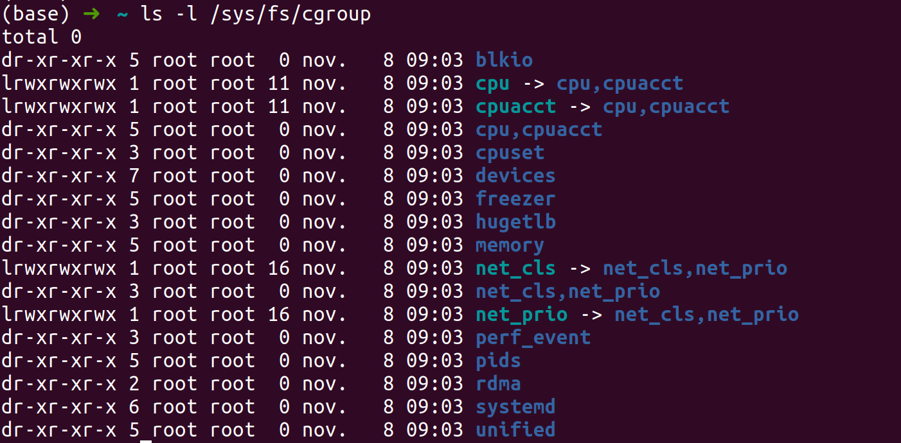
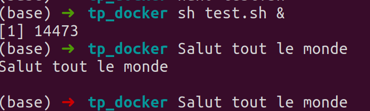
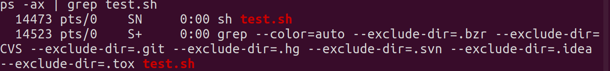

# TD1: Les groupes de contrôle (cgroup)

un groupe de controle est une fonctionnalité du noyau Linux qui prermet la gestion hiérarchique et l'allocation des ressources système. Par exemple, il est possible de limiter l’usage de la RAM, du processeur ou de l’espace disque d’un processus.

d'un point de vue Unix aprés la phse de boot un premier processus est créé /bin/init, il sert à démarrer les processus nécessaires au fonctionnement du système (daemons, gettys) qui pourront à leur tour créer des processus. il y a donc ici une question de arborescence où le processus /bin/init est au sommet, si on le supprime tout le processus fils (c’est-à-dire tous ceux créés par ce dernier)  sont detruits.

la force des cgroups est qu'il peux faire cohabité plusieurs arborescence de processus sans qu'elles soit interconnectéer. Avec les cgroups toutes le arborescence sont rattaché par un ou plusieurs sous-système.

On entend par sous-système, une ressource unique comme un temps processeur ou un accès mémoire.

Pour afficher la liste des sous-systèmes tapez la commande:

```bash
ls -l /sys/fs/cgroup
```

  

Voici quelques description des cgroups :

- **blkio (Block IO Controller)**: Permet de gérer les accès aux périphériques de type block comme les disques durs.

- **cpu**:  Utilise le scheduler pour fournir aux processus des cgroups

- **cpuacct (CPU Accounting Controller)**: Permet de générer automatiquement des rapports sur les ressources CPU utilisées par les processus d’un cgroup.

- **cpuset**:  Permet d’assigner un ou plusieurs CPU physiques aux processus d’un cgroup

## création d'un cgroup " test "

**Attention !**

Les commandes devront être exécutées depuis l'utilisateur root. La commande “sudo” ne sera pas suffisante. Utilisez une machine virtuelle Linux si ce n’est pas votre cas.

### 1/ Création d'un répertoire test dans /sys/fs/cgroup/memory
```bash
mkdir /sys/fs/cgroup/memory/test
```
Et voilà, notre premier cgroup est créé !

Par défaut le cgroup créé dans le sous-systéme memory hérite de la totalité de l'espace mémoire disponible.

Il suffit de créer un fichier memory.limit_in_bytes contenant la valeur souhaitée en **octet**

```bash
echo 30000000 > /sys/fs/cgroup/memory/test/memory.limit_in_bytes
```
Nous alons créé un script "test.sh"

```bash
#!/bin/bash
while true
do
        echo "Salut tout le monde"
        sleep 60
done

```

Pour lancer notre script :
```bash
sh ./test.sh &
```

Ce script print "Salut tout le monde" dans le terminal toute les 60 seconds

  

Récupérez le PID du processus de votre script précédemment lancé.

```bash
 ps -ax | grep test.sh
 ```
 

Dans notre cas le PID ( **P**rocess **id**entifier ) est **14473**.

Maintenant que nous connaissons le PID de notre script, voyons de quoi a-t-il hérité en terme d’accès système.

```bash
ps -ww -o cgroup 14473
```
**Resultat :**

9:blkio:/user.slice,7:pids:/user.slice/user-1001.slice/user@1001.service,6:cpu,cpuacct:/user.slice,**5:memory:/user.slice/user-1001.slice/user@1001.service**,2:devices:/user.slice,1:name=systemd:/user.slice/user-1001.slice/user@1001.service/apps.slice/apps-org.gnome.Terminal.slice/vte-spawn-1e54c1e5-8730-46f4-b395-4dbc409c37a4.scope,0::/user.slice/user-1001.slice/user@1001.service/apps.slice/apps-org.gnome.Terminal.slice/vte-spawn-1e54c1e5-8730-46f4-b395-4dbc409c37a4.scope

  On observe que notre processus est rattaché au sous-système **memory**


Pour profiter de la limitation des 30Mo de notre cgroup test nous devons déplacer le processus 6476 vers le cgroup test.

```bash
echo 14473 > /sys/fs/cgroup/memory/test/cgroup.procs
ps -ww -o cgroup 14473

```

**Resultat :**

9:blkio:/user.slice,7:pids:/user.slice/user-1001.slice/user@1001.service,6:cpu,cpuacct:/user.slice,5:**memory:/test**,2:devices:/user.slice,1:name=systemd:/user.slice/user-1001.slice/user@1001.service/apps.slice/apps-org.gnome.Terminal.slice/vte-spawn-1e54c1e5-8730-46f4-b395-4dbc409c37a4.scope,0::/user.slice/user-1001.slice/user@1001.service/apps.slice/apps-org.gnome.Terminal.slice/vte-spawn-1e54c1e5-8730-46f4-b395-4dbc409c37a4.scope


On constate cette fois-ci que le processus du script test.sh est lié au cgroup test du sous-système memory. Le reste est inchangé.

Maintenant qu’il fait partie du cgroup test, nous pouvons également le monitorer.

```bash
cat /sys/fs/cgroup/memory/test/memory.usage_in_bytes
```
688128

L’occupation de la mémoire est d’environ 700ko.

maintenant on va détruire le processus test.sh

```bash
kill 14473
```

Nous allons créer un second cgroup avec un espace mémoire plus petit (5 ko)

```bash
mkdir /sys/fs/cgroup/memory/test2
```
```bash
sudo nano 5000 > /sys/fs/cgroup/memory/test2/memory.limit_in_bytes

```
On exécute le script et on recupere le PID. on déplace le processus test.sh vers le cgroup test2. Après quelque seconde le processus crash car il utilise trop de mémoire
