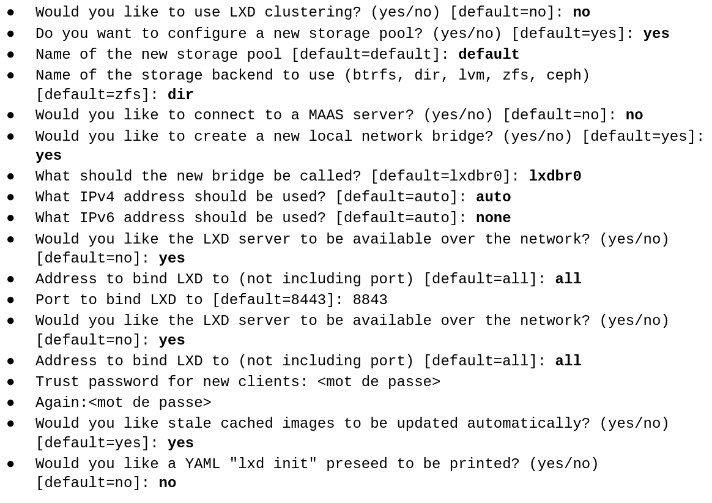
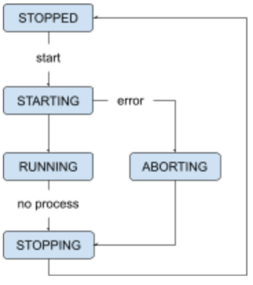
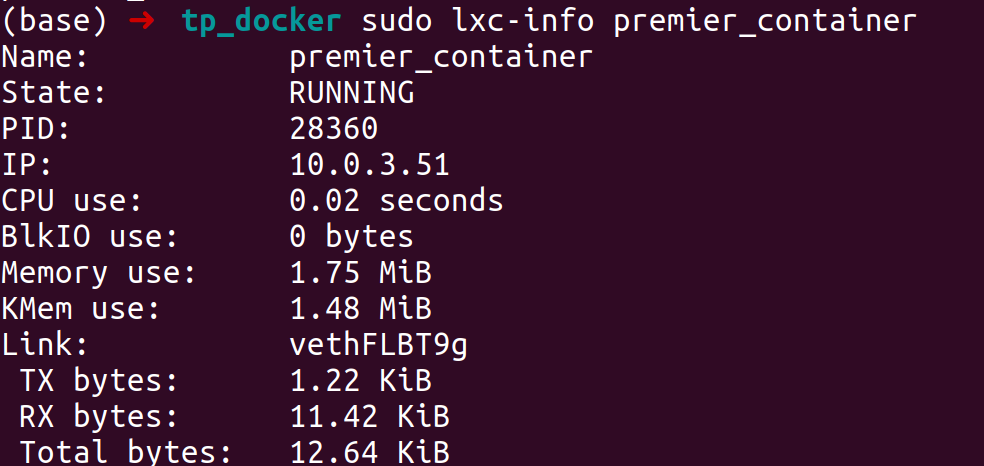
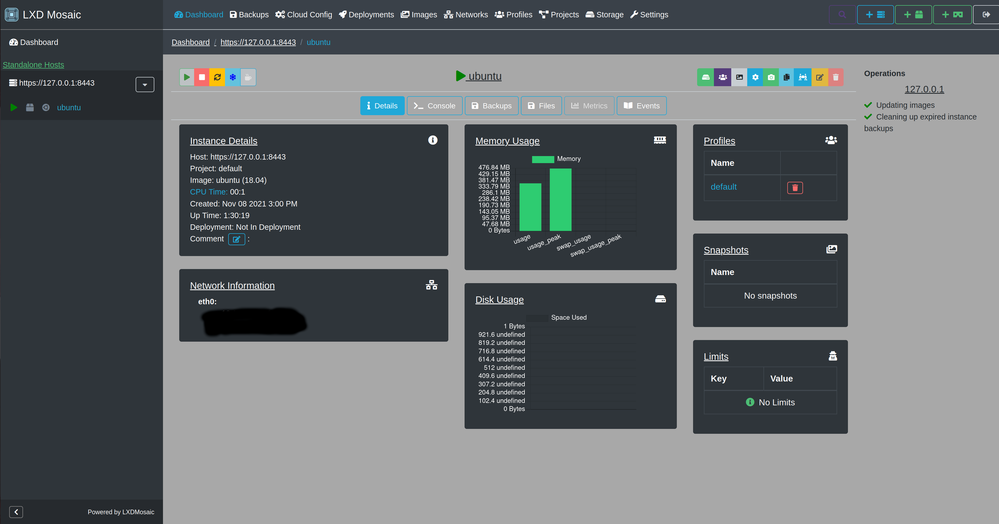

# TP2: Les containers LXC

## Installation

La grande majorité des fonctionnalités étant déjà présentes dans le noyau de la machine hôte, l’installation des paquets nécessaires au fonctionnement d’un container  ne prendra pas plus que quelques Mo.

```bash
apt update
apt upgrade
apt install lxc lxc-templates
```

Pour information, les templates seront installés dans le répertoire  /usr/share/lxc/templates et leurs configurations respectives dans /usr/share/lxc/config.

Pour installer lxd, utilisez le gestionnaire de packages snap:

```bash
apt install snapd
snap install core
snap install lxd
```

Vérifiez votre configuration avec la commande:

```bash
lxc-checkconfig
```
## Configuration initiale de LXD

Avant son utilisation Lxd doit être initialisé. Pour cela procédez comme ceci :

```bash
lxd init
```

  

## Test

### Premier conteneur

LXC permet aussi bien de créer de petits containers contenant le minimum vital que de gros containers intégrant une distribution Linux complète . Pour ce premier exemple, nous allons utiliser le template  lxc-busybox. Busybox est un container ne pesant pas plus de 2 Mo !

```bash
lxc-create -n premier_container -t busybox
```
- -n : nom du container
- -t : template

On le démarre :
```bash
lxc-start premier_container
```

Il ne nous reste plus qu’à se connecter en mode console à ce conteneur avec la commande :
```bash
lxc-attach premier_container
```

le container est fonctionnel !!!

Pour sortir du mode console du containers taper la commande exit ou bien faite  la combinaison de touche Ctrl+D.

**Remarque :**
le container tourne toujours, on peux le vérifié avec la commande :
```bash
lxc-ls -f --running
```

### Cycle de vie d'un container
Lorsqu'un conteneur est lancé, une première phase d’initialisation est exécutée . Le conteneur passe d'abord par un l’état STARTING. Si cette phase se déroule correctement, il changera d’état passera alors en RUNNING.

En cas de défaillance lors de l'initialisation, il passera dans l’ état ABORTING, puis sera stoppé.

  

Pour visualiser l'état du containers :
```bash
lxc-info premier_container
```
  

Maintenant stoppons ce containers :
```bash
lxc-stop premier_container
```
### Création d’un container ubuntu

créon un container  ubuntu 18.04 :

```bash
sudo lxc launch ubuntu:18.04 ubuntu
```

Puis on se connecte en bash au container

```bash
sudo lxc exec ubuntu bash
```
On quitte avec :
```bash
exit
```
Faisons un petit récapitulatif. Nous avons créé un container ubuntu à partir de l’image ubuntu:18.04 avec la commande lxc launch. Puisque l’image ubuntu:18.04  n’était pas disponible en local, elle a été téléchargée.  On a pu vérifier que le conteneur une fois installé, était directement utilisable. La commande exit nous permet de sortir du conteneur sans pour autant l’éteindre. Les commandes , lxc list ou lxc-ls permettent de vérifier l’état de notre container.

Il nous faut vérifier maintenant les différents fichiers qui constituent notre container. Pour cela rendez-vous dans le répertoire  /var/lib/lxc/. Affichez son contenu avec la commande ls. C’est ici que se trouvent les fichiers qui constituent votre container. Ouvrez le répertoire Ubuntu et affichez son contenu. On y trouve un fichier config, qui contient les différents éléments de configuration de votre conteneur, et le répertoire rootfs qui correspond au système de fichiers de votre conteneur.

### Mise en place d’un serveur web dans le container ubuntu

On ce remet dans le container puis on le met à jour et on upgrade.
```bash
apt update
apt upgrade
```

On installe apache2
```bash
apt install apache2
```
On peut vérifier que apache soit bien installé avec la commande :
```bash
netstat -plnt
```

### Gestion des fichiers

#### Copie de fichier du container vers l’hôte

On crée un fichier vide “fichier1” à la racine de votre utilisateur root du container ubuntu.

```bash
touch fichier1
```
On sort du container et on sort le fichier "fichier1" du container vers l'hôte :
```bash
lxc file pull ubuntu/root/fichier1 /home/$USER
```
Sur l’hôte, créez un fichier index1.html
```bash
echo “<H1>Coucou</H1>” > ./index1.html
```

Pour copier le fichier index1.html présent sur l’hôte vers le container ubuntu:
```bash
sudo lxc file push ./index1.html ubuntu/var/www/html/index1.html
```
### Rendre le serveur web accessible
Les périphériques proxy autorisent le transfert des connexions réseau entre l'hôte et une instance (un container). Ceci permet au trafic réseau atteignant l’adresse IP de notre hôte d’être redirigé vers l’adresse IP interne d’un container.
Ici, nous allons rédiger les connexions sur le port 80 de notre hôte vers le port 80 du container ubuntu et rendre accessible notre serveur apache.

```bash
sudo lxc config device add ubuntu myport80 proxy listen=tcp:0.0.0.0:80 connect=tcp:127.0.0.1:80
```

## TP3 : Gestion d'un serveur LXD

installez l'interface web de gestion LxdMosaic

```bash
sudo lxc config set core.trust_password Abc-123!
```
Abc-123! est le mot de passe.

Le serveur LxdMosaic est lancé sur l'adresse 127.0.0.1

  

Cette interface permet la gestion de container LXC.
