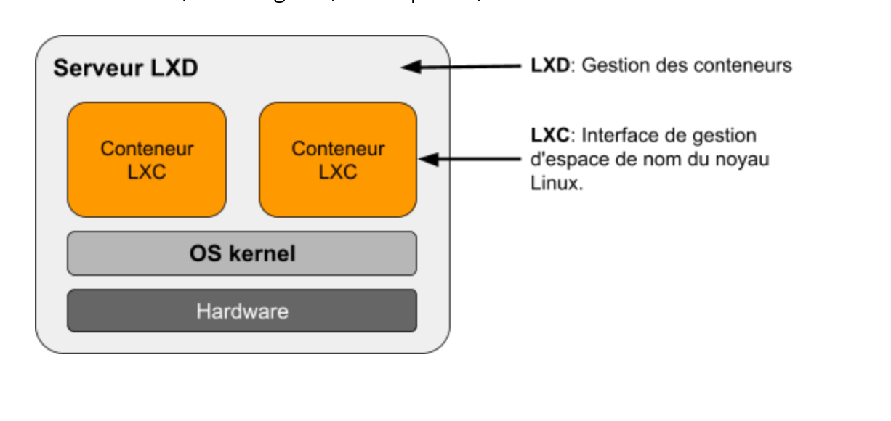

# TD Linux Container (LXC / LXD)

## LXC ?

LXC est un ensemble d'outils et de librairies propres à Linux, notamment conçu à l'exécution de conteneurs.

On peut distinguer deux types de conteneurs :

- Fat(gras) qui revient à faire tourner un OS entier dans un container,
- Thin(mince) qui revient à containeriser une application.

## LXD

LXD est un outil de gestion de container LXC :

- Mise en cluster
- Sauvegarde
- Snapshots
- ...

  

## Comment est-ce que cela fonctionne ?

LXC s'appuient sur deux technologies de Linux:

- Les cgroups (groupes de contrôle) permettent d’allouer, de limiter et de prioriser l’accès aux ressources (Cpu, mémoire, accès disque, bande passante réseau, etc …).

- Les namespaces (espace de nom) permettent une isolation complète d'une application dans l'environnement système comme l’arborescence des processus, le réseau, les utilisateurs et le montage des systèmes de fichiers.

:::{important}
Les conteneurs LXC partagent le même noyau que la machine hôte. Les containers hébergés doivent donc être compatibles avec le noyau de la machine hôte.
:::