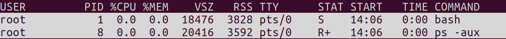

# TD1: Les espaces de noms (namespaces)

Un namespace est une instance des ressources système disponible sur un hôte. Cette instance a pour fonction d'isoler un processus du contexte système.

Voici les différents espaces de nom disponibles sur un système Linux.

- cgroups : Virtualisent la vue des processus appartenant à un groupes de contrôle notamment la vue des répertoires  /proc/[pid]/cgroup et /proc/[pid]/mountinfo.

- PID : isole l’arborescence d’un processus.

- mount : isole les points de montage du système hôte.

- network : isole les périphériques réseaux , port, etc…

- user : isole les IDs des utilisateurs et groupes du système hôte.

- time : permet de virtualiser l’horloge système.

- uts : isole les hostnames et noms de domaine.

Dans les faits chaque processus possède son propre sous-répertoire /proc/[pid]/ns/ contenant une entrée pour chaque espace de nom pouvant être manipulé (notamment avec la commande setns)

```bash
ls -l /proc/$$/ns | awk '{print $1, $9, $10, $11}'
```
lrwxrwxrwx cgroup -> cgroup:[4026531835]

lrwxrwxrwx ipc -> ipc:[4026531839]

lrwxrwxrwx mnt -> mnt:[4026531840]

lrwxrwxrwx net -> net:[4026532008]

lrwxrwxrwx pid -> pid:[4026531836]

lrwxrwxrwx pid_for_children -> pid:[4026531836]

lrwxrwxrwx time -> time:[4026531834]

lrwxrwxrwx time_for_children -> time:[4026531834]

lrwxrwxrwx user -> user:[4026531837]

lrwxrwxrwx uts -> uts:[4026531838]

Cette commande permet de listé tout les namespace de la machine.

Lors de la création d'un nouvel espace de nom , l’isolation se fait sur trois axes :

- Lorsqu’un nouvel namespace PID est initialisé, le processus prend le numéro de PID 1;

- Une nouvelle pile réseau est allouée au processus. Dès lors aucun conflit d’adresse est possible avec les services réseaux de l'hôte même s’il possède la même IP;

- Les systèmes de fichiers sont indépendants, on peut monter et démonter des volumes sans que cela ait une incidence sur l'hôte.

Les principales commandes pour la manipulation des espaces de nom sont:

- **clone** pour la création d’un nouvel espace de nom
- **setns** permet de joindre un processus à un espace de nom existant
- **unshare** déplace un processus vers un espace de nom existant
- **ioctl** permet de récupérer et manipuler les relations entre espaces de nom existant

Nous allons crée un nouveau namespace puis exécuté un bash dedans

```bash
unshare --fork --pid --mount-proc bash
```
- --fork en a fait un fils à unshare
- --pid : créé son propre PID. Notre processus possède le PID 1.
- --mount-proc : autorise la création d’un système de fichier proc.

  

Noter que ce n’est plus le processus /sbin/init qui possède le PID 1 mais notre bash lancé depuis la commande unshare.  bash est bien détaché de l’arborescence des processus de notre hôte grâce à son nouvel espace de nom. Il sera donc le père de tous les processus lancés à partir de ce namespace.

Si maintenant on sort du namespace ( commande 'exit') et que l'on affichage le processus, on retrouve bien tout les processus de l'hôte.
