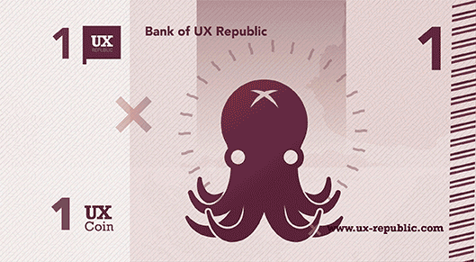

# Acheter une fonctionnalité

## Késako ?
“Acheter une fonctionnalité” est un jeu qui permet d'amener les utilisateurs, en leur donnant une somme d'argent fictive, à choisir les fonctionnalités qu’ils aimeraient avoir dans un produit donné.

Cette technique de priorisation est amusante et retient bien plus facilement l'attention des joueurs car en s'appuyant sur la notion d'argent, elle leur permet de s'impliquer bien plus qu'un simple classement arbitraire.

Il est très simple à jouer, et fournit des informations très utiles.

## Comment y jouer ?
Le jeu se déroule en petit groupes de 3 à 5 personnes, Le jeu prends entre 30 minutes et 1h30 maximum.
*(Cela dépend de la taille du groupe et du nombre de fonctionnalités à choisir)*

Les joueurs reçoivent collectivement une pile d'argent factice leur permettant d'acheter des fonctionnalités.
*(Une variante existe ou l'argent est attribué à chaque joueur)*

Le maitre du jeu liste les fonctionnalités et les joueurs doivent choisir celles qu'ils veulent dans leur produit, tout en expliquant leur choix.
Si besoin, les joueurs peuvent demander des explications supplémentaires sur les fonctionnalités, et le maitre du jeu doit être en capacité de leur expliquer.

Evidement les joueurs n'ont pas assez d'argent pour acheter toutes les fonctionnalités.
Cela les oblige à choisir les fonctionnalités dont ils ont réellement envie / besoin.

## Comment préparer le jeu ?
Voici quelques conseils pour vous aider à préparer votre jeu "Acheter une fonctionnalité" :

### Lister les fonctionnalités :
Avant de pouvoir jouer au jeu, vous devez bien évidement défnir une liste de fonctionnalités.
*(Les fonctionnalités devront être centrées sur l'utilisateur. Vous ne pouvez pas mettre comme fonctionnalité "Optimisation back-end".)*
    
Vous allez constituer votre liste avec :
- Des **fonctionnalités souhaités** lors de la **phase** de **recherche de marché**
- Des **suggestions** des **futurs utilisateurs**
- Des **fonctionnalités** de **produits similaires**

Chaque fonctionnalité doit inclure un nom, une description courte et un avantage pour l'utilisateur. Il ne doit pas y avoir plus de 30 fonctionnalités proposées aux joueurs.
Si vous en avez plus c'est que la granularité est trop fine et vous devez faire vos fiches à un niveau d'abstraction supérieur.

L'idéal est même de réaliser un jeu de cartes que vous pourez distribuer aux joueurs, en reprenant dessus, leur noms leur prix et leur avantages.

### Estimer les cartes

Première chose il est fondamental de prendre une devise factice. Sinon le joueur associera le prix fictif avec le coût réel, et cela cassera complétement la dynamique du jeu.

Vous pouvez par exemple prendre la devise, UX Coins, du site [UX-Republic](www.ux-republic.com).

*Voici un gif de cette devise:*

Pour déterminer le prix des cartes, dites-vous que le prix doit être proportionnel à la difficulté de réalisation de la fonctionnalité *(cela parait logique)*, mais que surtout chose importante le prix des cartes doivent être proportionnelles entre elles.

Par exemple, pour une fonctionnalité de difficulté 10 UX Coins: 
Si pour vous une autre tache est 2 fois plus complexe, elle doit être de difficulté 20 UX Coins et pas 40 UX Coins.
L'ideal est donc de prendre une fonctionnalité facile à réaliser et de ce baser sur cela pour définir les prix des cartes.

Il faudra fournir une somme d’argent qui permettra d’acheter uniquement entre la moitié et un tiers des fonctionnalités proposés.

Voilà vous avez tous les élements nécessaires pour pouvoir jouer à "Acheter une fonctionnalité !"

Bon jeu !

Auteur : LOCHON Nathan - [@limentic](https://github.com/limentic)