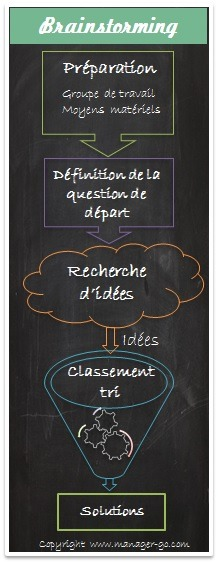

# Brainstorming

## Créateur
Alex Osborn

## Objectif
L'objectif du brainstorming est de générer rapidement un grand nombre d'idées afin de résoudre un problème.

## Principe
Un brainstorming se passe en 4 étapes:
- **Préparation;**
- **Définition de la question de départ;**
- **Recherche d'idées - la phase de production;**
- **Classement.**

*schéma des 4 étapes*

### I - Préparation

C'est pendant cette phase que l'animateur constitue un groupe de travail efficace et pertinent.
Efficace de par un nombre de personnes maximum oscillant entre 5 à 10 personnes
Pertinent par un choix de personne éclectique, que ça soit par **différents métiers**, **expertises** ou même **position hiérarchique**.

Le choix de l'environnement et des outils est aussi important, ils doivent faciliter les échanges.

### II - Définition de la question de départ - Phase de cadrage

L'objectif est de vérifier que tout les participants ont le même niveau d'information et que tout le monde est d'accord sur le problème à résoudre.
L'animateur fixe aussi le périmètre de la rechercher d'idée et du temps alloué.

### III- Recherche d'idées - la phase de production

C'est pendant cette phase chaqu'un va pouvoir exprimé des idées telles qu'elles lors viennent à l'esprit.
Il est impératif qu'il n'y est pas de censure, ni de jugement. Seule la spontanéité.

Le but étant de générer un maximum idée, l'animateur doit encourager les participants introvertis tout en cadrant les plus bavards, sans les bloquer.

Il est important que tout les idées soit écrite au fur et à mesure et visible de tous (paperboard, post-it).

### IV - Classement

cette phase est découper en deux phase:
- **filtrage des idées;**
- **sélection des solutions.**

Dans la phase de **filtrage des idées**, il faut nettoyer la liste des idées. **Regrouper** par analogie pour créer des "métas" idée, **suppression** des idées en doublons, **élimination** des idées les plus farfelus, ect.

À la fin de cette phase, on obtient une liste d'idées plus "propre", cette phase est nécessaire pour entrer dans la **sélection des solutions** sereinement.

Durant **l'étape de sélection des solutions**, il faut définir des **critères d'appréciation** pour classer les idées et faire apparaître les idées les plus intéressantes à travailler.

## Source
- www.manager-go.com
- www.ux-republic.com

Auteur : BELLEC corentin - [@cbellec](https://github.com/cbellec)
