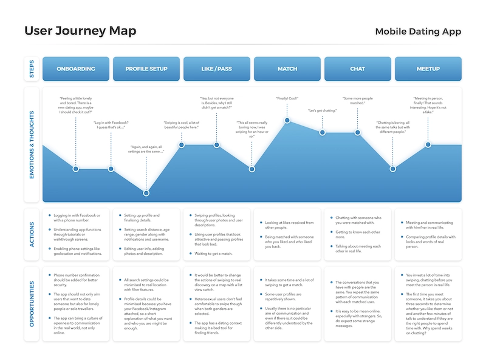

# User Journey
 
## Qu’est-ce que c’est ?
 
Le User Journey correspond à l'expérience qu'un utilisateur a eu lors de son utilisation d'un produit ou d'un service. Ce qu'il a fait, de quelle manière, pourquoi et quelle expérience il en a tiré. Plus généralement, cela représente son parcours tout au long de l'utilisation du produit/service et se découpe en plusieurs grandes phases par lesquelles l'utilisateur doit passer pour atteindre ses objectifs. 
 
## Quel est son objectif ?
 
Son objectif est donc basé sur l'observation d'une retranscription de l'expérience d'un utilisateur. Qu'est ce qu'il a fait et de quelle manière? qu'est ce qu'il a éprouvé et pourquoi? Il s'agit de la réponse d'un ensemble de questions permettant de qualifier le besoin auquel l'utilisateur devait répondre en effectuant ses actions.
Il permet principalement d'observer les problèmes rencontrés par les utilisateurs, les incompréhensions, les points de frictions ou les insatisfactions pendant son parcours pour mettre en place des solutions en fonction des différents Personas analysés.
 
## Comment ça marche ?
 
Le User journey est donc représenté de différentes manières, cela peut être une vidéo, un graphique, une frise chronologique, etc...
Ces différentes représentations sont découpées en plusieurs parties distinctes représentant chacune le parcours global et détaillé de l'utilisateur ainsi que les observations/analyses qui peuvent en être tirées.
 
Par exemple, la frise ci-dessous représente le parcours d'un utilisateur sur une application de rencontre en partant du lancement de l'application jusqu'à la première rencontre.
On peut observer les différentes émotions que l'utilisateur a ressenties tout au long du parcours selon les actions qu'il a effectuées et donc son expérience utilisateur.

Auteur : Goncalves Denis - [@dgoncalv1](https://github.com/dgoncalv1)