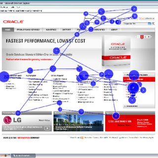

# Eye tracking

## Qu’est-ce que c’est ?

Le Eye Tracking est une technique qui permet de suivre les mouvements des yeux d’une personne. Cela permet de savoir où elle regarde dans l’ensemble. Cette technique est aujourd’hui utilisée dans différents domaines comme la médecine, le sport ainsi que le bâtiment et s’ouvre progressivement à d’autres domaines. 

## Comment ça marche ?

Il faut mettre un utilisateur devant un écran marchant avec l’Eye Tracking, puis lui faire quelques tests de calibrage pour que les capteurs de la technologie Eye Tracking soient opérationnels. Ensuite, il faut afficher par exemple un site sur l’écran et demander à l’utilisateur d’y faire une action, comme acheter un produit sur un site e-commerce.

Les données que nous pouvons obtenir par rapport à l’utilisateur sont :

- Où regarde-t-il ?
- Combien de temps cherche-t-il ?
- Comment le regard se déplace d'un élément à l’autre ?
- Quelles parties de l'interface manque-t-il ?
- Comment navigue-t-il sur la longueur de la page ?
- Comment la taille et le placement des éléments attirent l'attention ?

## Quel est son objectif ?

En général, il faut passer et cliquer sur différentes pages et boutons pour arriver à ce que l’on veut. Son objectif est donc de les comprendre, de les identifier et de les modifier si nécessaire, car ils influent sur les décisions de l’acheteur. Nous pouvons voir cela grâce à la génération de synthèse de l’heatmap et du scanpath qui nous permettent d’avoir des rapports détaillés sur la vision de l’utilisateur.

*Exemple visualisation Heatmap*

*Exemple visualisation Scanpath*

Auteur : LEMONNIER Baptiste - [@BaptisteKSP](https://github.com/BaptisteKSP)